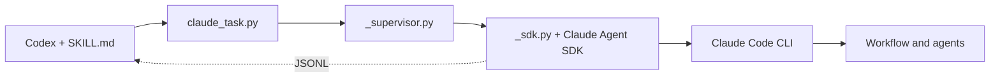

# Claude Agent

A Codex skill for delegating tasks to an installed Claude Code CLI. Supports individual tasks, session continuation, and dynamic workflows with multiple agents.

The adapter uses the official Python Claude Agent SDK and Claude Code's existing authentication and history. Claude Desktop is not required. The adapter has no database, MCP server, or persistent background service.

## Use in Codex

Name the skill and describe the task:

```text
Use claude-agent to review error handling in the current project.
Read-only review.
```

For a workflow:

```text
Use claude-agent to run a dynamic workflow that reviews the current project:
two independent reviewers, followed by verification of their findings.
```

[SKILL.md](SKILL.md) contains the instructions for Codex. Tasks use the current project directory unless another location is specified. Claude loads its native project and global `CLAUDE.md` instructions, including symlinks to `AGENTS.md`; these files do not need to be copied into the prompt.

## Install from dotfiles

Requires Python 3.11+, `claude` on `PATH`, and working Claude Code CLI authentication.

```sh
skill_root="$HOME/.dotfiles/.agents/skills/claude-agent"
python3 "$skill_root/scripts/install_runtime.py"
```

The installer creates `.venv` beside the skill and installs the dependencies pinned in [requirements.txt](scripts/requirements.txt). After cloning dotfiles on another machine, create the runtime again: `.venv` and caches are excluded from Git.

In this setup, Codex discovers the skill through this symlink:

```text
~/.codex/skills/claude-agent -> ~/.dotfiles/.agents/skills/claude-agent
```

On a new machine where the link does not exist yet:

```sh
mkdir -p "$HOME/.codex/skills"
ln -s "$skill_root" "$HOME/.codex/skills/claude-agent"
```

Individual scripts do not need registration. `SKILL.md` is the skill entry point, and supporting files live in the same directory tree. This setup does not require a `config.toml` entry.

## Manual invocation

Run these examples from the project directory, with `skill_root` set as above. Prepare a UTF-8 file at `work/claude-task.txt` containing the task, allowed changes, and expected result.

```sh
python3 "$skill_root/scripts/claude_task.py" \
  --cwd "$PWD" \
  --access read \
  --prompt-file ./work/claude-task.txt
```

Model and effort use Claude Code's native defaults unless explicitly overridden with `--model MODEL` or `--effort LEVEL`. Either flag can be supplied independently. These options apply to the main Claude session; agent-specific overrides belong in the Workflow script. For all options:

```sh
python3 "$skill_root/scripts/claude_task.py" --help
```

| Option | Purpose |
| --- | --- |
| `--cwd` | Required working directory for Claude. |
| `--model` | Optional model override; accepts a name or alias supported by the CLI. |
| `--effort` | Optional effort override: `low`, `medium`, `high`, `xhigh`, or `max`; support depends on the model and CLI. |
| `--access` | Built-in tool profile: `none`, `read`, or `edit`. Defaults to `read`. |
| `--allow-command` | Additional Bash permission rule. Repeatable; for example, `--allow-command 'git diff *'`. |
| `--resume` | UUID of an existing Claude session. |
| `--timeout` | Execution timeout in seconds, excluding approval waits. Defaults to 900. |
| `--approval-timeout` | Timeout for one approval request. Defaults to 3600 seconds. |

`read` includes Read, Glob, and Grep. `edit` also includes Edit and Write. These profiles select built-in tools; they are not a filesystem sandbox. Claude's native settings, hooks, connectors, and permission rules remain active.

### Continue a session

Take `session_id` from the previous result and prepare `work/followup.txt`:

```sh
python3 "$skill_root/scripts/claude_task.py" \
  --cwd "$PWD" \
  --resume SESSION_UUID \
  --access read \
  --prompt-file ./work/followup.txt
```

Replace `SESSION_UUID` with the actual UUID. Calls to one session must run sequentially with the same working directory. Codex keeps the ID in chat context; Claude Code stores the conversation history. Another Codex chat does not automatically receive this ID.

## Dynamic workflows

Explicitly request a dynamic workflow in `work/workflow-task.txt`, then run:

```sh
python3 "$skill_root/scripts/claude_task.py" \
  --cwd "$PWD" \
  --access read --workflow \
  --prompt-file ./work/workflow-task.txt
```

Keep the process's stdin open: approval decisions arrive through it. In Codex, launch the adapter with `tty: true`. Workflow mode requires a prompt file because stdin carries the control protocol.

When Claude prepares a script, the adapter emits `approval_required` with the exact workflow input, request ID, and input hash. The Workflow call stays suspended until a matching decision arrives. Saved Claude rules, including `ask: ["Workflow"]`, are not changed.

See [references/workflows.md](references/workflows.md) for the decision format, event sequence, and continuation rules.

## Results and interruption

The adapter emits JSONL: one JSON event per line. Wait for the final `type: result` event. An intermediate `workflow_finished` event does not include the coordinator's final synthesis.

| Status | Meaning |
| --- | --- |
| `completed` | The task completed successfully. |
| `denied` | The workflow was declined, or the approval input closed before a decision. |
| `needs_permission` | A tool request did not receive the required permission. |
| `timed_out` | Execution or approval waiting timed out. |
| `cancelled` | Execution was cancelled. |
| `workflow_not_started` | Workflow mode was requested, but no workflow launch was observed. |
| `incomplete` | The workflow or its final synthesis did not complete. |
| `failed` | Execution failed. |

Permission denial reasons appear in `permission_denials`. An error message, when available, appears in `error`. The `models` field lists actual models reported by the native session, which may include auxiliary Claude models.

Omitted model and effort overrides appear as `null` in the request metadata. This does not report Claude's resolved defaults; use `models` for the actual models used.

A refusal, EOF, or approval timeout closes approvals for the current invocation. Later and already queued requests are denied immediately. See the workflow reference for details.

On cancellation, timeout, or loss of the calling process, the supervisor stops the worker process group. After an interrupted call, a returned `session_id` alone does not guarantee complete history; inspect the result and project changes before resuming.

## Components



| File | Role |
| --- | --- |
| [SKILL.md](SKILL.md) | Instructions for Codex. |
| [references/workflows.md](references/workflows.md) | Workflow and approval protocol. |
| [scripts/claude_task.py](scripts/claude_task.py) | Arguments, environment checks, and launch. |
| [scripts/_supervisor.py](scripts/_supervisor.py) | Process supervision and event forwarding. |
| [scripts/_sdk.py](scripts/_sdk.py) | SDK calls, approvals, progress, and final status. |
| [scripts/install_runtime.py](scripts/install_runtime.py) | Local Python runtime setup. |
| [scripts/requirements.txt](scripts/requirements.txt) | Pinned SDK dependency. |
| [agents/openai.yaml](agents/openai.yaml) | Skill display name and description; not Claude agent definitions. |
| [tests/](tests/) | Adapter tests and a fake SDK. |

## Development checks

Tests use a fake SDK and CLI without contacting a model:

```sh
PYTHONDONTWRITEBYTECODE=1 python3 -B -m unittest discover \
  -s "$skill_root/tests" -v
```

## Troubleshooting

- `dependency_missing`: run the runtime installer from the installation section.
- `history_unwritable`: the execution environment blocks writes to Claude's own history. Grant this access through the environment's normal permission mechanism.
- Authentication errors: check the installed Claude Code CLI's login. The adapter does not use Claude Desktop authentication.

Interactive Visualize panels are created separately in the chat. Automatic panels and continuous status updates are not built into this skill.
